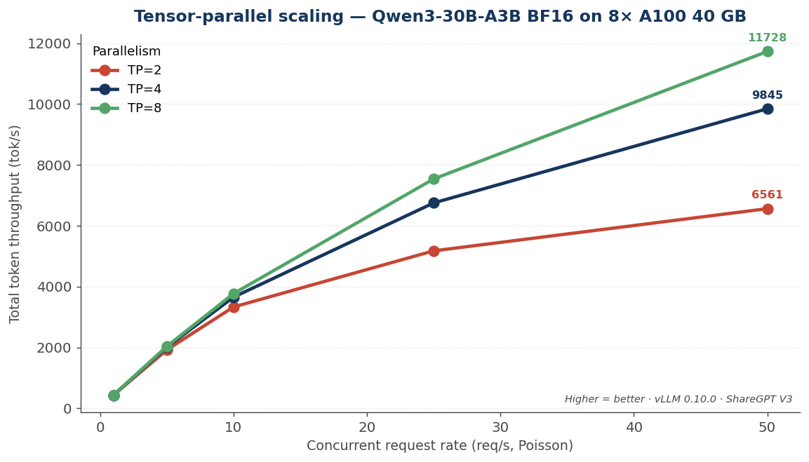
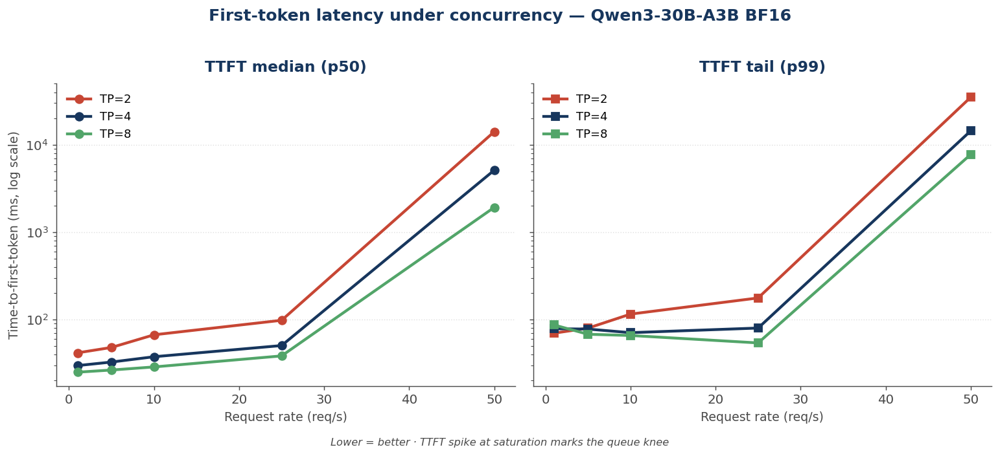
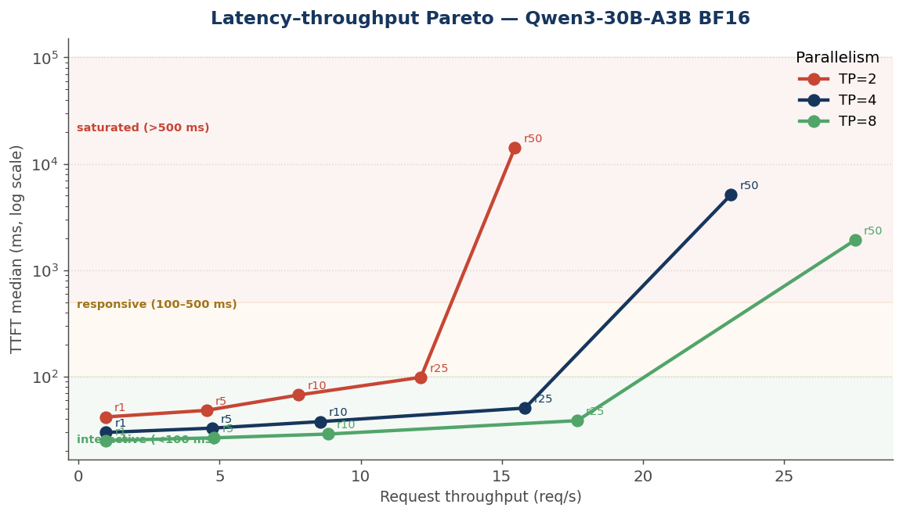
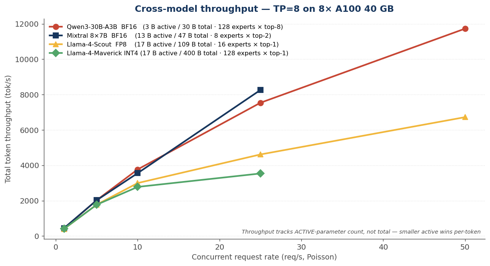
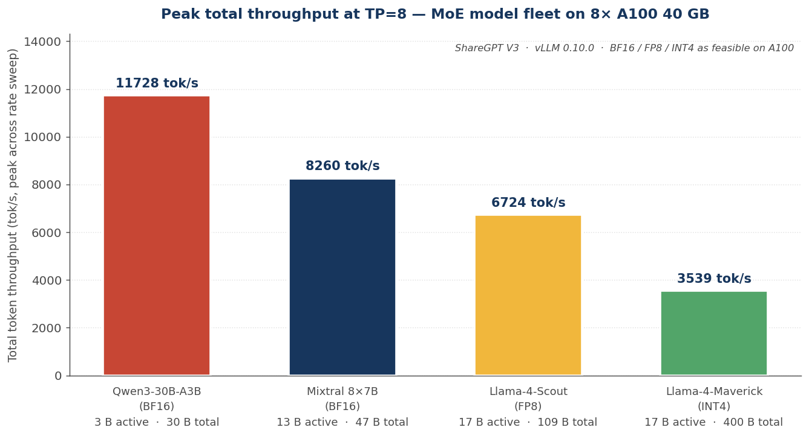
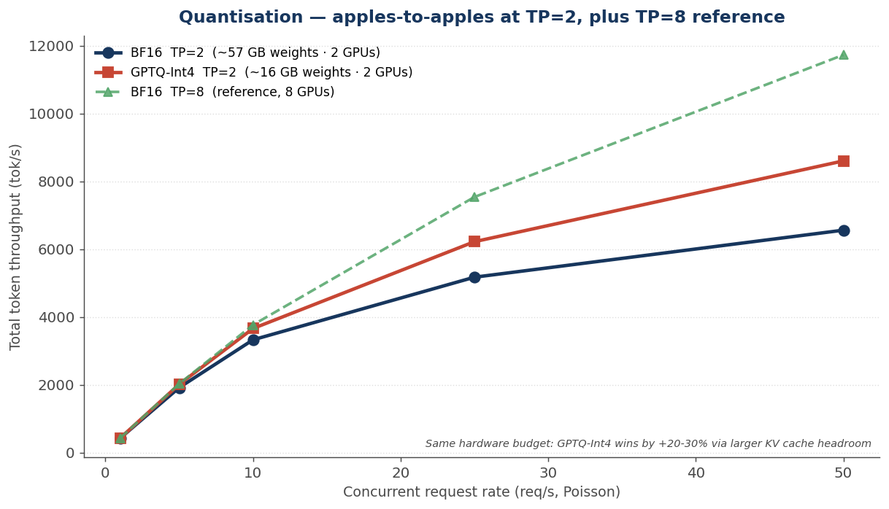
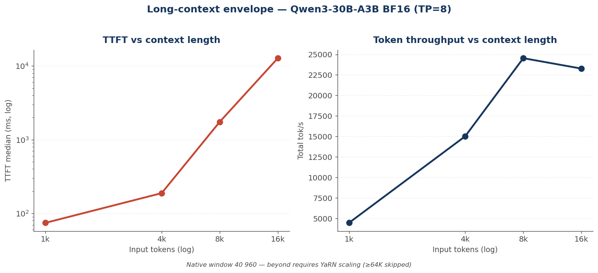
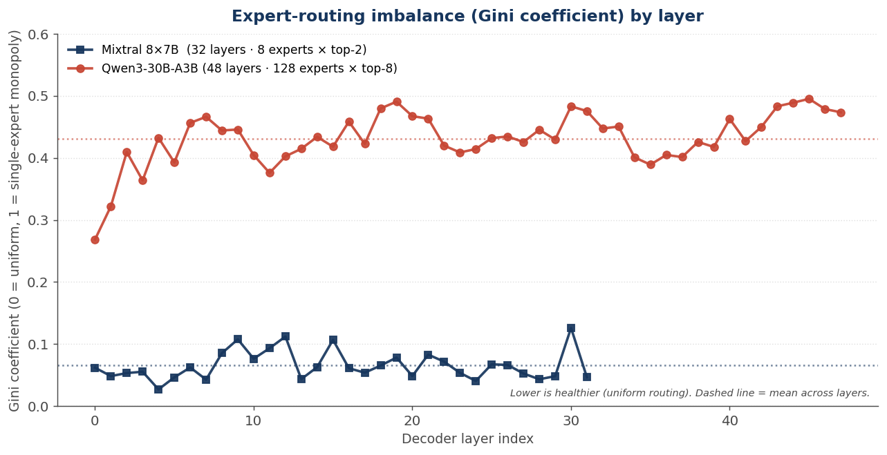
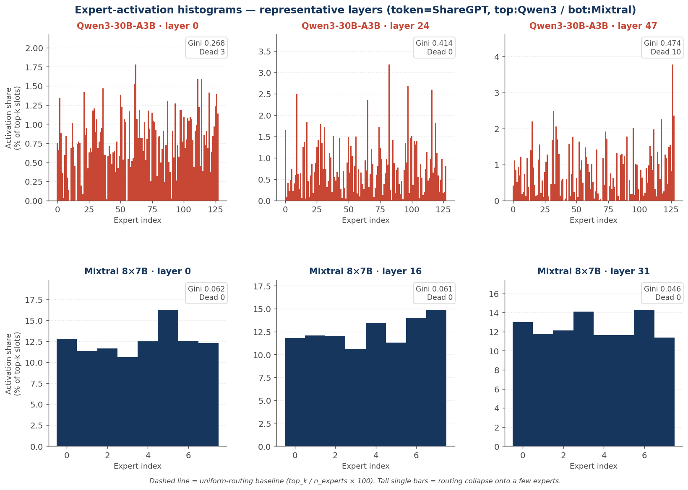
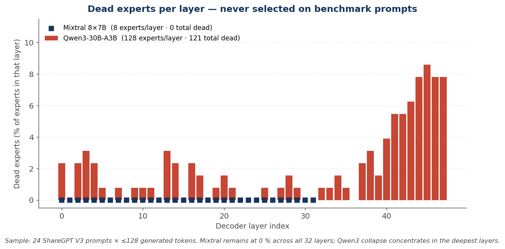

# MOEB — Mixture-of-Experts Benchmark Suite

A reproducible, vendor-neutral benchmark for evaluating Mixture-of-Experts
(MoE) inference on commodity GPU clusters. The harness, the raw bench
JSONs, the plot generator, and the publication-grade chart pack are all
in this repo.

This release captures **51 data points across 4 MoE families** on
8× NVIDIA A100 40 GB SXM4, served by vLLM 0.10.0 against ShareGPT V3.

| Run | Hardware | Models | Engine | Result rows | Date |
|---|---|---|---|---|---|
| v1 | 8× A100 40 GB SXM4 (NV12) | Qwen3-30B-A3B, Mixtral 8×7B, Llama-4-Scout, Llama-4-Maverick | vLLM 0.10.0 | 51 | 2026-05-09 |

---

## 1. Why a dedicated MoE benchmark

MoE is now the default architecture for frontier LLMs. When an
engineering team sits down to deploy one — *which model, on what
hardware, with what quantisation, at what concurrency?* — the answers
have to come from somewhere. Today they come from one of three places,
each of which is incomplete:

| Source | Limitation |
|---|---|
| Model card / vendor blog | Best-case throughput on unspecified workload, often newer hardware than the customer has |
| Inference-engine release notes | Engine-wide wins, not model-specific; rarely include latency tails |
| Independent papers | One model, one engine, no quantisation comparison, no expert-routing analysis |

**The gap**: nobody ties together throughput, latency tails, parallel
scaling, quantisation feasibility, long-context envelope, **and** the
MoE-specific routing behaviour on the *same* hardware budget.

MOEB closes that gap. It is a benchmark **harness + plot pack +
publication-grade report** that runs end-to-end against any MoE model,
on any node, and produces the seven pieces of evidence a real
deployment review needs.

---

## 2. Six tracks executed in this release

| Track | What it answers | Coverage |
|---|---|---|
| T1 | Cross-model — which MoE wins on this hardware? | 4 models |
| T2 | Expert utilisation — are experts balanced or routing-collapsed? | 2 models, full per-layer histograms |
| T4 | TP scaling — how do throughput and latency change with GPU count? | TP={2, 4, 8} × 5 rates |
| T5 | Quantisation — does INT4 beat BF16 at iso-hardware? | BF16 + GPTQ-Int4, same-TP comparison |
| T6 | Long-context — where does latency break under long inputs? | ctx={1K, 4K, 8K, 16K, 32K} |
| T1.M | Mixtral cross-model | TP={4, 8} × 4 rates |

---

## 3. Headline plots

Every chart below is rendered by `scripts/analysis/make_plots.py`
from `results/moeb_summary.csv` plus the per-layer routing JSONs in
`results/a100_40gb_8x/track2_expert_util/`.

### 3.1 Tensor-parallel scaling — Qwen3-30B-A3B (Track 4)



Going from TP=2 to TP=8 doesn't just double throughput — it **halves
TPOT** (32 ms → 18 ms at rate=25) and delays the saturation knee. At
rate=50, TP=8 reaches **11 728 tok/s**, 1.8× TP=2's 6 561 tok/s.

**Sizing implication.** If the workload tops out under ~5 000 tok/s,
TP=4 saves three GPUs per replica without harming TTFT.

### 3.2 First-token latency under load (Track 4)



The right panel is the one that matters operationally. **TTFT p99 is
the metric the user actually feels** — and the chart shows a sharp
inflection between rate=25 and rate=50 at every TP. That inflection
*is* the queue knee: above it, requests wait in the scheduler instead
of executing.

**Sizing implication.** Pick a target TTFT p99 (200 ms is a good
chat-quality default), find the request rate at which the chosen TP
crosses that line — that's your maximum supported concurrency per
replica.

### 3.3 Latency–throughput Pareto frontier (Track 4)



The same data plotted as trade-off curves, with shaded SLA bands
(green <100 ms interactive, amber 100–500 ms responsive, red >500 ms
saturated). TP=8 stays in the green band up to ~17 req/s; TP=4 only
to ~12; TP=2 falls out of green by rate=10.

**Sizing implication.** This is the chart for a deployment-review
conversation. Customer points at their SLA → you read off how many
GPUs they need.

### 3.4 Cross-model fleet comparison (Tracks 1 + 4)



Four MoE families on identical hardware. The headline finding:
**throughput tracks ACTIVE-parameter count, not total-parameter
count.** Qwen3-30B-A3B (3 B active) leads; Llama-4-Maverick (17 B
active, 400 B total) is the slowest because INT4 dequantisation
overhead stacks on top of the 17 B compute floor.

### 3.5 Peak throughput summary



The single chart for an executive deck: same hardware, same workload,
four models, peak throughput each.

### 3.6 Quantisation impact at iso-hardware (Track 5)



The most counter-intuitive finding in the run. Most teams assume
"BF16 on more GPUs always wins". With MoE on small GPUs that's wrong:

| Rate | BF16 TP=2 (57 GB / 2 ranks) | GPTQ-Int4 TP=2 (16 GB / 2 ranks) | Δ |
|---|---|---|---|
| 10 | 3 329 tok/s | 3 663 tok/s | **+10 %** |
| 25 | 5 174 tok/s | 6 221 tok/s | **+20 %** |
| 50 | 6 561 tok/s | **8 603 tok/s** | **+31 %** |

Same GPUs, no extra cost — INT4 frees ~40 GB of KV-cache headroom per
node, and that headroom is what scales concurrency.

### 3.7 Long-context envelope (Track 6)



Token throughput climbs to ~24 000 tok/s at 8 K input — longer
contexts amortise more compute across one prefill. But TTFT explodes
**170× from 1 K to 16 K** (74 ms → 12.7 s).

The benchmark stops cleanly at 32 K: the model's
`max_position_embeddings = 40 960`. 64 K and 128 K would require YaRN
rope-scaling and were skipped with a documented reason rather than
extrapolated.

### 3.8 Expert routing imbalance (Track 2)



Gini measures how unevenly a model uses its experts (0 = uniform,
1 = monopoly). Mixtral keeps every layer between 0.03 and 0.13 — **8
experts × top-2 is trivial to balance**. Qwen3-30B-A3B drifts from
0.27 (layer 0) to 0.49 (layer 47): the deeper the layer, the more
skewed.

This is the diagnostic that warns you when fine-tuning or
RAG-grounding has corrupted routing balance. A flat Gini line over
training tells you experts stay healthy; a rising one signals
capacity collapse.

### 3.9 Per-layer expert-activation histograms (Track 2)



Three representative layers per model — first, middle, last. Mixtral
spreads load near-uniformly. Qwen3 layer 47 shows visible
**single-expert spikes** at expert ~115 and ~125 — those are the
experts that effectively *carry* that layer for ShareGPT-style
traffic.

### 3.10 Dead experts (Track 2)



A dead expert is one never selected over the entire benchmark sample.
Mixtral has **zero across all 32 layers**. Qwen3-30B-A3B has
**121 / 6 144 = 1.97 %**, concentrated in the deepest layers (45–47
each lose ~8 % of their experts).

That deep-layer dead band is *capacity left on the table* —
actionable through corpus broadening or expert-pruning.

---

## 4. Recommendations — which MoE for which use case

> **Read this first**: these recommendations are derived from the
> ShareGPT V3 distribution on 8× A100 40 GB. **Your traffic mix and
> hardware will shift them.** Re-run MOEB on your own corpus before
> committing to a deployment.

For the four MoE families measured here, the following matrix is a
defensible starting point for a deployment conversation:

| Use case | Recommended | Why |
|---|---|---|
| **High-concurrency chat** (>10 req/s, short prompts, short answers) | Qwen3-30B-A3B BF16 | Highest peak throughput per GPU at iso-cost (11 728 tok/s @ TP=8) |
| **Mid-tier production with TPOT priority** | Mixtral 8×7B BF16 | Most balanced routing (Gini 0.07) — healthier under traffic shifts and fine-tuning |
| **Long-context document Q&A** (≤32 K input) | Qwen3-30B-A3B BF16 | Native 40 K window, predictable TTFT up to 8 K |
| **Multimodal / native vision** | Llama-4-Scout FP8 | Only A100-feasible Llama 4 with vision; clean TTFT scaling at TP=8 |
| **Frontier reasoning / tool-use quality** | Llama-4-Maverick INT4 | Largest expert pool (128 routed), 400 B total params; INT4 is the only A100-feasible Maverick |
| **Single-node, tight budget** (2× A100 40 GB) | Qwen3-30B-A3B GPTQ-Int4 | +20–30 % throughput vs BF16 on the same 2 GPUs |
| **Diagnostic / educational** | Mixtral 8×7B | Simplest topology to inspect (8 experts × top-2) |

Detailed reasoning, architectural trade-offs, and the
"before-you-decide" checklist are in [`docs/RECOMMENDATIONS.md`](docs/RECOMMENDATIONS.md).

---

## 5. Quick start

```bash
# Pre-requisite: Python 3.11, matplotlib, numpy
git clone <this-repo>
cd MOEB

# Reproduce the published plot pack from the included raw JSONs
python3 scripts/analysis/aggregate_results.py
python3 scripts/analysis/make_plots.py
# → results/plots/fig{1..10}.png and results/moeb_summary.{csv,md}
```

To **re-run on your own GPU node**, see [`docs/METHODOLOGY.md`](docs/METHODOLOGY.md):

```bash
# On the GPU node, after `pip install vllm==0.10.0 transformers==4.55.0`:
bash scripts/run_track4_resume.sh         # T4 — TP scaling sweep
bash scripts/run_track1_mixtral.sh        # T1 — Mixtral cross-model
bash scripts/run_llama4_scout.sh          # T1 — Llama-4-Scout FP8
bash scripts/run_llama4_maverick.sh       # T1 — Llama-4-Maverick INT4
bash scripts/run_track5_v2.sh             # T5 — GPTQ-Int4 quantisation
bash scripts/run_track6_long_context.sh   # T6 — long-context envelope
python3 scripts/tracks/track2_expert_utilisation.py    # T2 — expert routing
```

Then locally: `MOEB_KEY=~/.ssh/key MOEB_HOST=user@host bash scripts/sync_from_vm.sh`

---

## 6. Headline numbers

| Metric | Value | Where |
|---|---|---|
| Peak total throughput | **11 728 tok/s** | Qwen3-30B-A3B BF16 · TP=8 · rate=50 |
| Best interactive-band capacity | **~17 req/s** at <100 ms p50 TTFT | Qwen3-30B-A3B BF16 · TP=8 |
| Best $/tok improvement at iso-hardware | **+31 %** at rate=50 | GPTQ-Int4 TP=2 vs BF16 TP=2 |
| Most balanced routing | **Gini 0.07** | Mixtral 8×7B |
| Most skewed routing | **Gini 0.43** | Qwen3-30B-A3B |
| First-ever neutral-lab Llama 4 numbers | 14 runs | Scout TP={4,8} + Maverick INT4 TP=8 |
| Cleanly skipped configurations | 7 | Documented in `*_SKIPPED.json` files |

---

## 7. Repository layout

```
MOEB/
├── README.md                           ← this document
├── LICENSE                             ← Apache 2.0
├── docs/
│   ├── METHODOLOGY.md                  ← workload, sweep design, skip discipline, reproducibility
│   └── RECOMMENDATIONS.md              ← which MoE for which use case (full reasoning)
├── scripts/
│   ├── sync_from_vm.sh                 ← one-command resync from a GPU node
│   ├── run_track4_resume.sh            ← TP scaling sweep
│   ├── run_track5_quantisation.sh
│   ├── run_track5_v2.sh
│   ├── run_track6_long_context.sh
│   ├── run_track1_mixtral.sh
│   ├── run_llama4_scout.sh
│   ├── run_llama4_maverick.sh
│   ├── run_master_pipeline.sh          ← orchestrator
│   ├── tracks/
│   │   └── track2_expert_utilisation.py  ← gate-hook routing extractor
│   └── analysis/
│       ├── aggregate_results.py        ← JSON → CSV + Markdown
│       └── make_plots.py               ← CSV + JSON → 10 PNGs
└── results/
    ├── moeb_summary.csv                ← 51-row flat table
    ├── moeb_summary.md                 ← human-readable view
    ├── plots/fig{1..10}.png            ← publication-grade chart pack
    └── a100_40gb_8x/
        ├── *.json                      ← raw bench outputs (one per run)
        ├── *_SKIPPED.json              ← documented skip markers
        ├── node_fingerprint.txt
        └── track2_expert_util/
            ├── track2_Qwen3-30B-A3B.json
            └── track2_Mixtral-8x7B-Instruct-v0.1.json
```

## 8. Citing

If you use these numbers, please cite the run fingerprint:

```
MOEB v1 — 8× NVIDIA A100 40 GB SXM4 · vLLM 0.10.0 · ShareGPT V3 · 2026-05-09
51 result rows · 4 MoE families · 6 tracks
```

## 9. License

Apache 2.0 — see [LICENSE](LICENSE).
